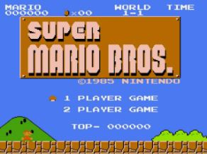

# Python Mario

Repositori game sebagai pelengkap dari materi pembelajaran di [Ruang Belajar Python](https://pujangga123.github.io/ruang-belajar-python) yang digunakan dalam perkuliahan pelajaran _Pemrograman Python_ di [STMIK Mardira Indonesia](http://stmik-mi.ac.id). Sebagai contoh dari implementasi OOP yang lebih _lengkap_ dibanding dengan contoh sederhana pada [latihan program sebelumnya](https://github.com/pujangga123/ruang-belajar-python/tree/master/python-program/pygame/mario).